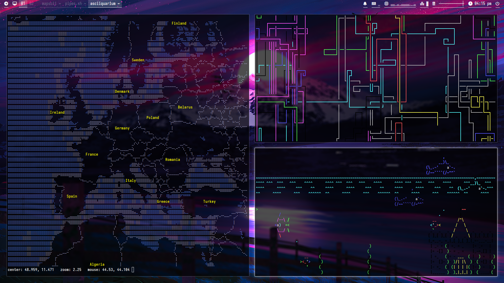
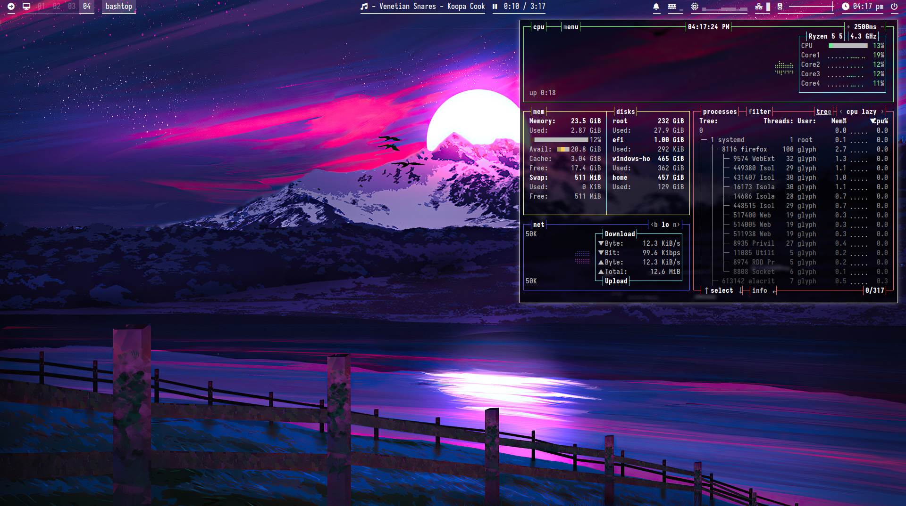

osate-de
========
My personal desktop environment using `i3-wm` and other programs like `polybar`, `picom`, `dunst`, `mpd`, et cetera.

Features
--------
For help with key shortcuts, you can press `win` + `?` to get a concise list of all the keybinds that I have configured for i3.

The topbar features a wide variety of modules.

1. Left: 
    * traybar that can be hidden 
    * list of workspaces 
    * list of running applications that can be interacted with

2. Center: 
    * scrolling text that displays the song playing on MPD 
    * media controller that can be scrolled on to scrub through the song

3. Right: 
    * dunst module that can be clicked on to mute notifcations and scrolled on to view dunst history 
    * modules for RAM, CPU, network, and volume - each can be clicked on and open corresponding programs (conky, bashtop, nmtui, and alsamixer, respectively)
    * clock that displays a rofi calender when clicked on
    * power menu that can also be accessed through `Ctrl` + `Alt` + `Del`

Credits
-------
All packages used can be found in the AUR or the Arch repos - read the `install.sh` bash script to see what apps are included.

Default wallpaper is made by me.

Screenshots
-----------

