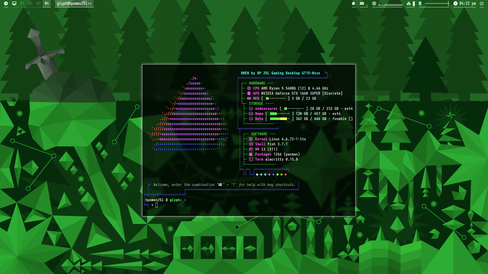

osate-de
========

My personal desktop environment using `i3-wm` and other programs like `polybar`, `picom`, `dunst`, `mpd`, et cetera.

Credits
-------
All packages used can be found in the AUR or the Arch repos - read the `install.sh` bash script to see what apps are included.
Default wallpaper is made by me.

Screenshots
-----------

